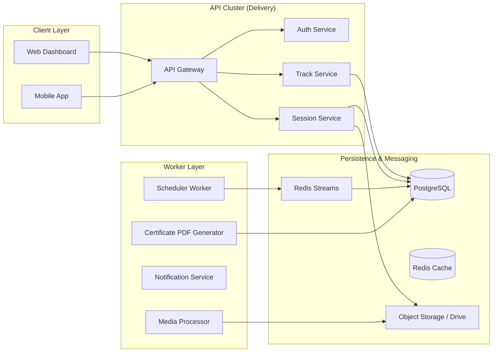

# Community Hub Architecture: Scaling Engagement

The GDGoC Benha System is designed as a highly decoupled, event-driven architecture that powers a modern community experience for thousands of students and a professional core team.

## 1. High-Level Architectural Flow

The system extends **Clean Architecture** with a **Background Worker Layer** to handle high-latency or scheduled tasks.

## 2. Advanced Communication Logic (Redis Streams)

For "Scheduled Content" and "Auto-Certification," we use a **Redis-based Task Queue**.

1. **Scheduling**:
   - The API writes a task to `SCHEDULED_TASKS` (Postgres) and pushes the ID to a Redis Stream (`task:scheduler`).
   - The **Scheduler Worker** polls at a 1-minute resolution.
2. **Certification**:
   - When a student's graduation bit is flipped, a `TRACK_COMPLETED` event is fired.
   - The **Certificate Worker** picks it up, generates a unique PDF, uploads it to S3, and emails the student.

## 3. High-Concurrency Security (Online/Offline Attendance)

The system is designed to handle thousands of concurrent scans or check-ins.

- **Offline QR**: 
  - The QR contains a signed `session_id` and `exp`.
  - The Backend validates the signature and ensures the `session_id` exists and is `ACTIVE`.
- **Online Code**:
  - The `attendance_code` is stored in **Redis** with a TTL of 10 minutes.
  - This ensures $O(1)$ lookup and automatic expiration, reducing database load during high-concurrency "Submit Code" windows.

## 4. Scalability & Resilience (Edge Cases)

| Failure Scenario | Recovery / Mitigation Strategy |
| :--- | :--- |
| **Postgres Downtime** | Redis maintains active session tokens. All GET requests fallback to a stale cache if available. Writes are queued in a local buffer (Internal only). |
| **Redis Flush** | The system automatically re-populates the cache from PostgreSQL. `RoleLevel` and `AuthCodes` are reconstructed during the first request after failure. |
| **Worker Failure** | The `SCHEDULED_TASKS` table in Postgres ensures that missed tasks can be re-run manually once the worker service is restored. |
| **S3 / Drive Unreachable**| Media URLs are stored in Postgres. If the storage is down, the UI shows a "Media Temporarily Unavailable" placeholder instead of crashing. |

## 5. Domain-Driven Design (DDD) Core Layers

- **Entities**: Pure structs (User, Bootcamp, Track).
- **Use Cases**: `RegisterForEvent`, `LogAttendance`, `SubmitGrade`.
- **Infrastructure**: Implementations of `UserRepo` (Postgres), `SessionCache` (Redis), `StorageService` (Google Drive API).
