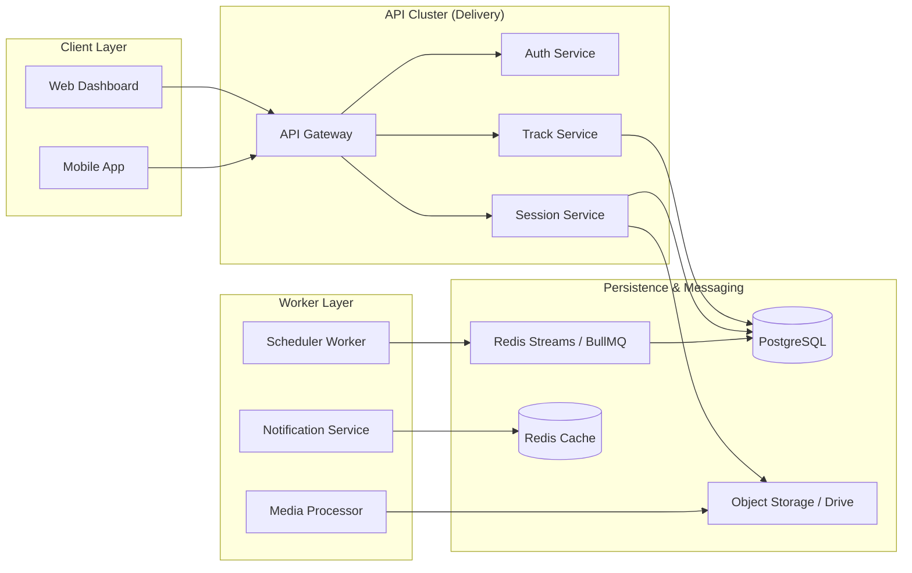

# Community Hub Architecture: Scaling Engagement

The GDGoC Benha System is designed as a highly decoupled, event-driven architecture that powers a modern community experience. 

## 1. High-Level Architectural Flow

The system extends the standard **Clean Architecture** with an **Event Bus** and **Background Workers** to handle complex tasks like content scheduling and media processing.



## 2. The Task Scheduling System (Go-Powered)

For "Scheduled News" and "Delayed Event Starts," we use a **Worker Pool Pattern**.

1. **Scheduling Logic**: When a Board member schedules a post for tomorrow at 10:00 AM:
   - The API writes the post to `NEWS_FEED` with `is_published = false`.
   - It inserts a row into `SCHEDULED_TASKS` with the `run_at` timestamp.
2. **The Worker Loop**:
   ```go
   // Periodic Ticker in internal/worker/scheduler.go
   ticker := time.NewTicker(1 * time.Minute)
   for range ticker.C {
       tasks := repo.GetPendingTasks(time.Now())
       for _, t := range tasks {
           go a.ProcessTask(t)
       }
   }
   ```
3. **Task Execution**: The worker updates the `is_published` flag in PostgreSQL and invalidates the `GET /news` cache in Redis.

## 3. Rich Session Media Integration

Sessions are the heart of the GDG community. We handle media and PDFs using a **Storage Adapter Pattern**.

- **PDFs (Google Drive)**: We store the `drive_pdf_link`. The backend ensures these links follow a strict format and validates them via the Google Drive API.
- **Gallery Images**:
  - Images are uploaded to S3-compatible storage.
  - The API stores the metadata in `SESSION_GALLERY`.
  - The frontend utilizes these links to render image carousels for past events.

## 4. Performance Tracking (Real-Time Scoring)

To maintain a high-performing core team, we use an **Atomic Update Pattern**.

- **Event-Driven Evaluation**:
  - When attendance is logged, a `SESSION_ATTENDED` event is fired.
  - The **Performance Worker** picks it up and increments the `CORE_TEAM_STATS.total_points`.
  - **Redis Cache Invalidation**: The core team member's dashboard stats are wiped in Redis so the next read fetches the fresh score.

## 5. Security for Core Team Internal Data

- **Domain-Specific Middlewares**:
  ```go
  // Restrict core team metrics to Heads and Board only
  r.GET("/v1/core-team/metrics", a.Authorize(800), a.GetMetrics)
  ```
- **Soft Deletion Auditing**: Any deletion of performance data triggers a log in `AUDIT_LOGS`, recording the `OldValue` to prevent core team members from hiding poor metrics.
