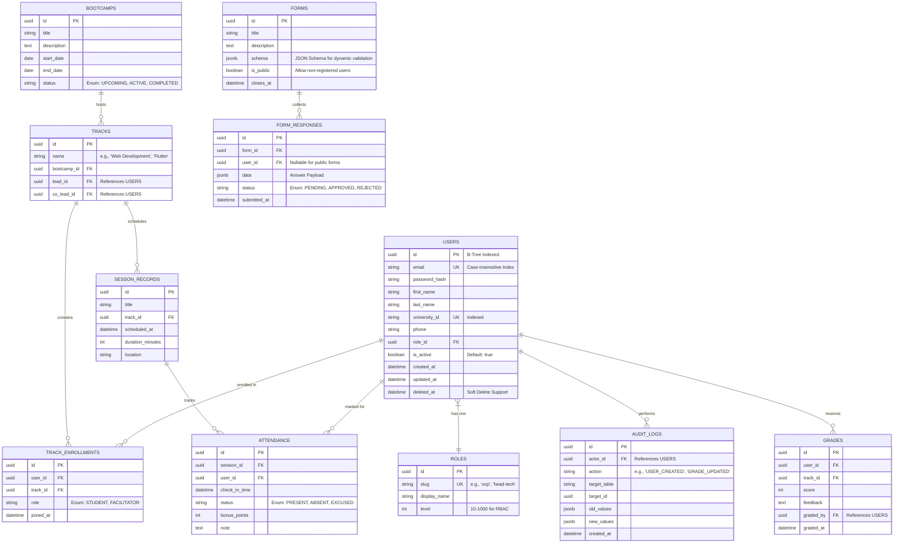

# Database Schema & Data Integrity: Deep Dive

The GDGoC Benha System utilizes PostgreSQL as its primary source of truth, emphasizing strict relational integrity, performance indexing, and auditability.

## 1. Advanced ERD (Full System)

This diagram covers the intricate relationships required for a multi-departmental GDG system.

## 2. SQL Integrity & Performance

### Indexing Strategy
- **Partial Indexes**: For frequently queried subsets (e.g., `WHERE is_active = true`).
- **GIN Indexes**: On `JSONB` columns in the `FORMS` and `FORM_RESPONSES` tables to allow efficient querying of dynamic form fields.
- **Foreign Key Constraints**: All relationships are strictly enforced with `ON DELETE RESTRICT` or `ON DELETE CASCADE` where appropriate (e.g., deleting a Track deletes its Enrollments).

### JSONB Schema Validation
- Form schemas will follow the **JSON Schema** standard.
- Before insertion into `FORM_RESPONSES`, the Go backend will validate the `data` payload against the `schema` defined in the `FORMS` table.

## 3. Data Auditing Policy
- The `AUDIT_LOGS` table records all state-changing operations by high-HL users (Heads/Board).
- It captures `old_values` and `new_values` for debugging and accountability, essential for a system with 10+ core team roles.

## 4. Soft Deletes
- Most tables include a `deleted_at` field. 
- **Purpose**: Prevent accidental data loss and maintain historical records (e.g., keeping attendance records of a student who dropped a bootcamp).
