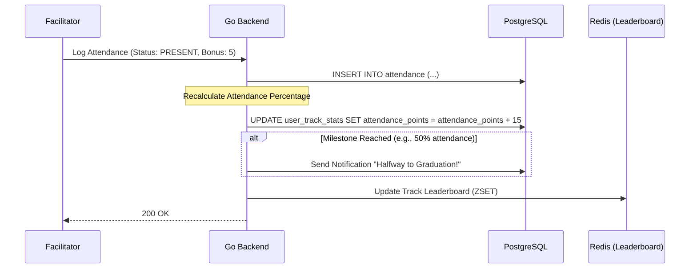

# Academic Evaluation & Grading Algorithms

The GDGoC Benha System automates student evaluation using a multi-weighted scoring algorithm. This document details the technical implementation of grading and performance tracking.

## 1. The Core Performance Algorithm

A student's total performance in a track is calculated using three main components:

1. **Attendance Score (A)**: Based on session presence and bonus points.
2. **Assignment Score (S)**: Based on grades given for specific tasks.
3. **Project Score (P)**: Based on final track projects.

### The Weighted Equation (Example)
The system uses a configurable weighted formula defined in the `TRACKS` metadata:
- $FinalGrade = (A \times 0.2) + (S \times 0.3) + (P \times 0.5)$

## 2. Technical Logic (The "Auto-Grader")

The backend automatically updates performance scores upon specific events.

## 3. High-Performance Leaderboards (Redis)

To provide real-time competitive rankings ("Top Students"), we use **Redis Sorted Sets (ZSETs)**.

- **Key**: `leaderboard:track:{track_id}`
- **Score**: The student's current total performance points.
- **Member**: The student's `user_id`.

This allows us to fetch the "Top 10" students in $O(\log N)$ time, avoiding complex PostgreSQL `GROUP BY` and `SUM` operations on every request.

## 4. Academic Integrity & Auditing

- **Immutable Grades**: Once a grade is approved by a **Track Lead (HL 600)**, it becomes read-only for facilitators.
- **Audit Logging**: Any manual override of a grade (e.g., by the **Head of Tech**) is logged in the `AUDIT_LOGS` table, capturing the reason for the change and the previous value.

## 5. Certification Workflow

When a student's $FinalGrade$ reaches the threshold (e.g., 70%):
1. The system marks them as `GRADUATED` in the `TRACK_ENROLLMENTS` table.
2. An event is triggered to generate a unique digital certificate.
3. The student receives an automated email via the **Communication Service**.
