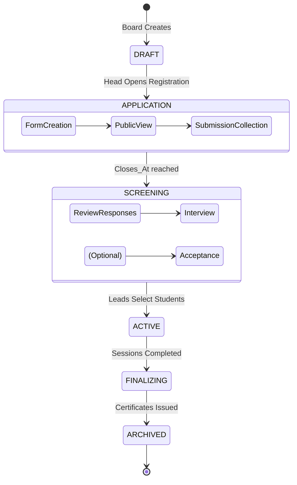

# Bootcamp Lifecycle & Track Management

The Bootcamp is the flagship educational program of GDGoC Benha. This document details the high-level orchestration, from initial planning to student graduation.

## 1. The Bootcamp State Machine

A bootcamp transitions through several critical phases, each with specific rules and automated triggers.

## 2. Track & Curriculum Management

Each bootcamp contains multiple specialized tracks (e.g., Backend, Frontend, Flutter).
- **Curriculum Definition**: Leads define a list of `SESSIONS_RECORDS` in advance.
- **Resource Allocation**: Each session is pre-assigned a `drive_pdf_link` (handouts) and a `thumbnail_url`.

## 3. The Selection Engine (Student Filtering)

To manage high volumes of applicants, the system uses a multi-stage filtering process:
1. **Initial Filter**: Automatically reject submissions that don't meet basic criteria (e.g., non-university email if required).
2. **Review Stage**: Track Leads (HL 600) review `FORM_RESPONSES`.
3. **Status Sync**: Once accepted, a `USER` is automatically linked to a `TRACK_ENROLLMENT` with the role `STUDENT`.

## 4. Edge Cases in Bootcamp Management

| Edge Case | System Response |
| :--- | :--- |
| **Track Switch** | A Lead can manually move a student between tracks. The system must recalculate the `CORE_TEAM_STATS` and performance scores for the new track. |
| **Late Registration** | If a form is closed, only an **OCP (HL 1000)** can bypass the `closes_at` check to manually add a student via the admin panel. |
| **Bootcamp Cancellation** | Soft-deletes all associated tracks and notifies all enrolled students via the `Notification Service`. |
| **Facilitator Change** | If a Facilitator (HL 300) leaves mid-bootcamp, their grading history remains (Audited), but their active session assignments are cleared. |
