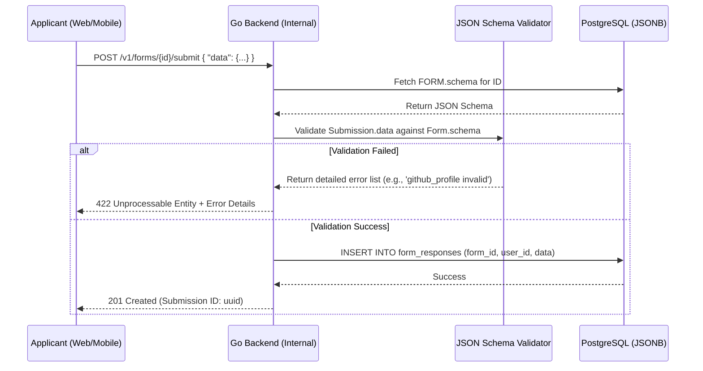

# Dynamic Forms & The JSONB Rendering Engine

A key architectural requirement of the GDGoC Benha System is the ability to create and manage any type of registration or feedback form without changing the database schema.

## 1. Core Logic: Schema-Driven Data

The `FORMS` table acts as a metadata repository for dynamic user interfaces. It uses the **JSON Schema** standard to define the structure of the data it collects.

### A. The Form Metadata (`FORMS` Table)
```json
{
  "title": "Flutter Bootcamp Registration",
  "description": "Apply for the upcoming Flutter track.",
  "schema": {
    "type": "object",
    "required": ["github_profile", "experience_level"],
    "properties": {
      "github_profile": { "type": "string", "pattern": "^https://github.com/.*" },
      "experience_level": { "type": "string", "enum": ["Beginner", "Intermediate", "Advanced"] },
      "why_us": { "type": "string", "minLength": 50 }
    }
  },
  "is_public": true,
  "closes_at": "2026-10-01T23:59:59Z"
}
```

## 2. Dynamic Workflow (Sequence Diagram)

This diagram details the server-side validation logic that ensures dynamic data integrity.



## 3. Advanced Querying of JSONB Data

One advantage of using PostgreSQL is the ability to query inside the `data` column. This is critical for **Marketing** and **Heads** to filter applicants.

- **Example SQL (Find all Advanced applicants)**:
```sql
SELECT * FROM form_responses 
WHERE form_id = '...' 
AND data->>'experience_level' = 'Advanced';
```
- **Performance**: We apply a **GIN (Generalized Inverted Index)** on the `data` column to ensure these queries remain fast even with thousands of responses.

## 4. UI/UX Strategy: Metadata to Components

The frontend (Web/Flutter) will not hardcode form fields. Instead:
1. It calls `GET /v1/forms/{id}`.
2. It parses the `schema` JSON.
3. It dynamically generates UI components (Text inputs, Dropdowns, DatePickers) based on the JSON types and enums.
4. It performs client-side validation using the same schema before sending the payload to the server.
