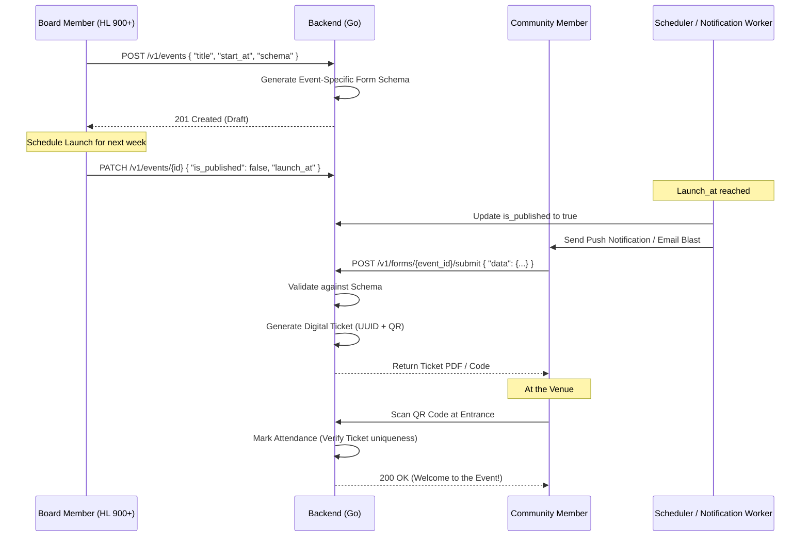

# Event Management & Community Engagement

GDGoC Benha runs diverse events, from large technical summits to internal team buildings. This document outlines the technical and operational flow for managing these events.

## 1. Event Classification

The system handles three tiers of events with different visibility and registration rules.

| Type | Target Audience | Registration Model | Visibility |
| :--- | :--- | :--- | :--- |
| **Public Summit** | Anyone (Students, Devs) | Public Form (no login required) | Search Engines, Social Media |
| **Track Event** | Enrolled Students | Authenticated Form | Track Dashboard Only |
| **Internal Event**| Core Team Only | Automated List | Core Team Dashboard Only |

## 2. The Event Lifecycle (Sequence Diagram)

This diagram shows the end-to-end flow from planning to post-event data analysis.

## 3. Ticketing & Check-in System

For large-scale public events, the system provides a robust ticketing mechanism:
1. **Uniqueness**: Each ticket is a `UUID4` tied to a `FORM_SUBMISSION_ID`.
2. **Redundancy**: Tickets can be scanned even if the student loses their PDF, by searching for their email or phone number in the `FORM_SUBMISSION` data.
3. **Capacity Management**: Once the `max_seats` limit is reached in the `EVENTS` table, the API automatically closes the registration form and notifies waitlisted users.

## 4. Post-Event Feedback & Engagement

Engagement doesn't end when the event finishes:
- **Feedback Collection**: An automated email is sent to all `PRESENT` attendees 2 hours after the event, linking to a dynamic feedback form.
- **Certificate Issuance**: For workshops, certificates are generated for those whose attendance is verified and feedback is submitted.

## 5. Event Edge Cases

| Edge Case | Technical Solution |
| :--- | :--- |
| **Speaker Change** | The `EVENTS` metadata includes an `extra_data` JSONB field. Updates here are reflected in real-time on the event page. |
| **Venue Capacity Reached**| The registration logic uses a **Redis Transaction** or `SELECT FOR UPDATE` to ensure atomicity during the seat increment. |
| **Multiple Registrations**| The system checks the `email` field inside the `JSONB` data payload to prevent multiple tickets for the same user. |
| **Event Cancellation** | An automated broadcast is sent to all ticket holders. Ticket status is marked as `VOID` in the database to prevent fraudulent check-ins. |
