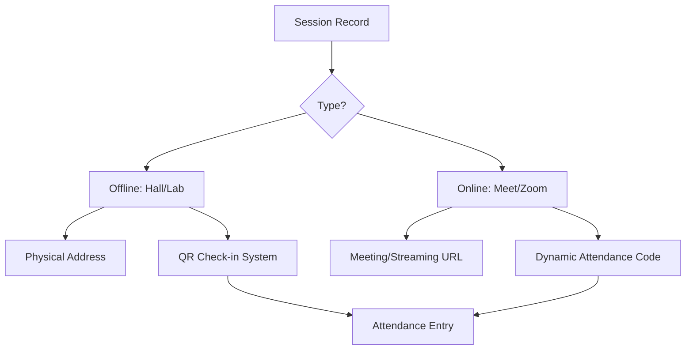

# Session Execution & Attendance Verification

This document details the operational logic for running both **Online** and **Offline** sessions for GDGoC community members and students.

## 1. Multi-Modal Session Execution

Sessions are the atomic unit of learning. The system handles two primary modes of delivery with different verification mechanisms.

## 2. Verification Mechanisms (Anti-Cheating)

### A. Offline: QR Code Check-in
1. **Generation**: The Track Lead (HL 600) generates a dynamic, time-limited QR code for the session.
2. **Action**: The student scans the QR code via the GDGoC App.
3. **Logic**: The app sends the user's `id`, `session_id`, and a `timestamp`.
4. **Validation**: The backend verifies the student is within the correct geographical radius (Optional) and that the session is currently active.

### B. Online: The "Live Verification Code"
1. **Scenario**: To ensure students actually attend online sessions (not just join and leave), the system uses a **Synchronous Verification Code**.
2. **Action**: During the session, the Facilitator (HL 300) publishes a 4-digit code (e.g., `8271`).
3. **Student UI**: A "Submit Attendance" field appears on the session page for a limited window (e.g., 10 minutes).
4. **Logic**: The code is stored in **Redis** with a short TTL (Time-To-Live). The student must enter the correct code before the key expires.
5. **Success**: If the code matches, the student is marked as `PRESENT`.

## 3. Session Resources & Rich Media
Each session provides a "Content Hub" for the student:
- **`drive_pdf_link`**: Attached handouts/slides.
- **`recording_url`**: Available after the session for asynchronous learning.
- **`session_gallery`**: Images from the session to drive community engagement.

## 4. Attendance Logic & Edge Cases

| Edge Case | Policy / Technical Solution |
| :--- | :--- |
| **Late Arrival** | Students checking in after 30 minutes are marked as `LATE` (50% points). The system uses the `check_in_time` against the `scheduled_at` time to calculate this. |
| **Excused Absence** | A student can request an excuse. A **Facilitator (HL 300)** must manually approve it, marking the status as `EXCUSED` in the `ATTENDANCE` table. |
| **Internet Failure (Online)**| If a student can prove a disconnection, a Lead can override their status via the `AUDIT_LOGS` flow. |
| **Session Postponement** | When `scheduled_at` is changed, all enrolled members receive a push notification via the **Notification Worker**. |

## 5. Automation: Points Calculation

The attendance status directly feeds into the **Grading Service**:
- **PRESENT**: `BasePoints + BonusPoints`
- **LATE**: `(BasePoints * 0.5) + BonusPoints`
- **EXCUSED**: `BasePoints * 0.25`
- **ABSENT**: `0 points`
