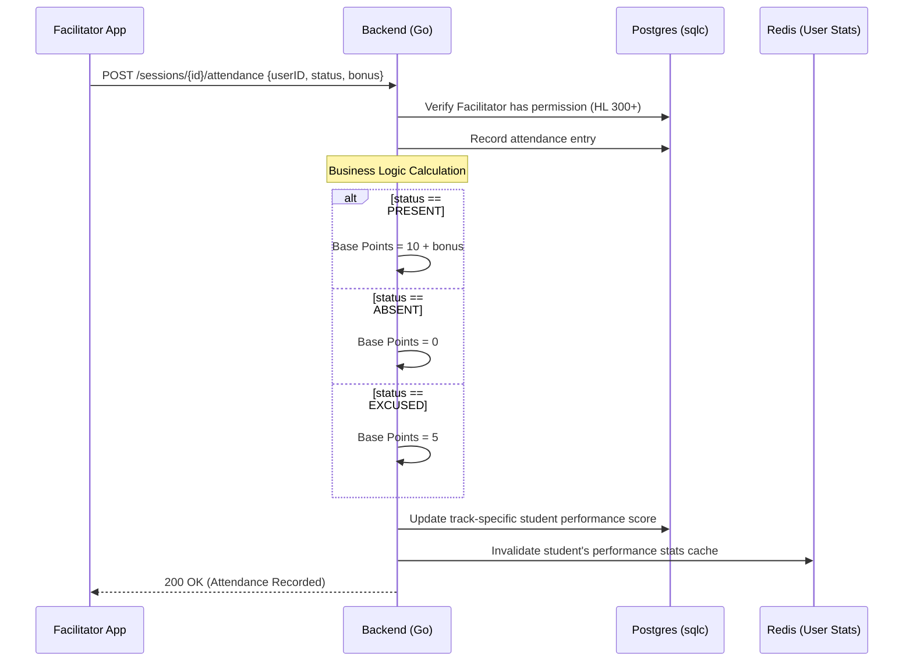
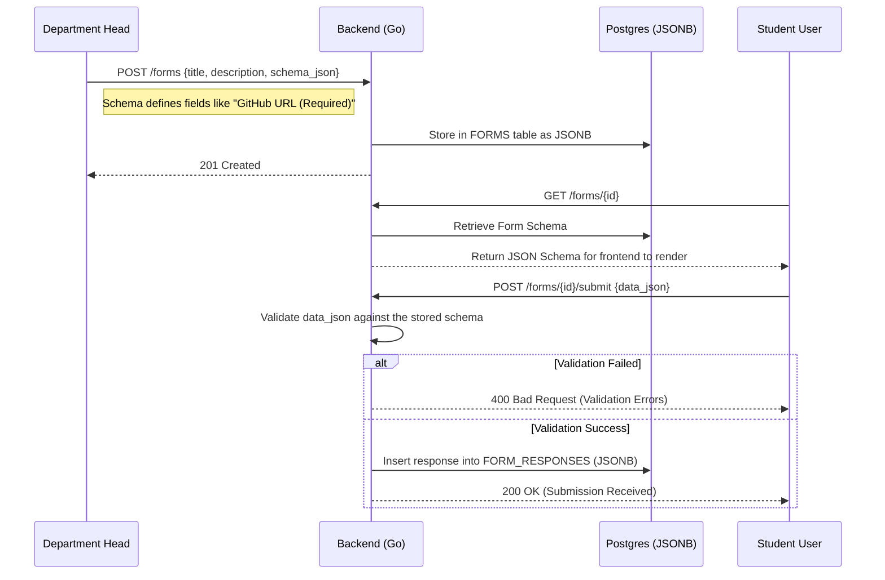
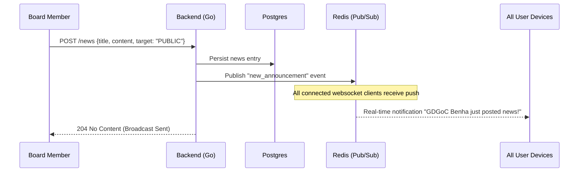
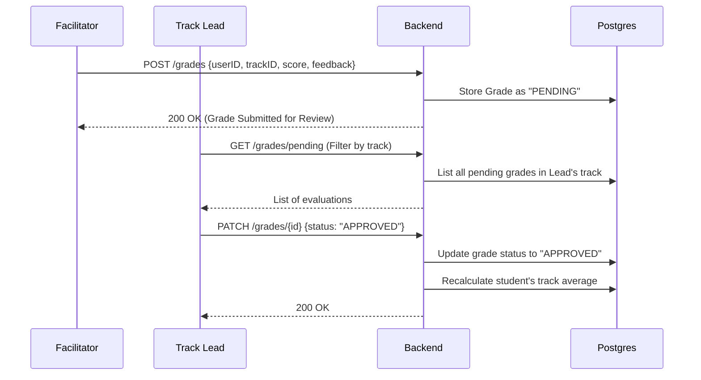

# System Workflows & Complex Logic

This document details the complex logic within the GDGoC Benha System using sequence diagrams.

## 1. Automated Attendance & Performance Scoring

When a Facilitator logs attendance for a student, the system automatically calculates the student's performance score based on the status (Present/Absent/Excused) and any bonus points.

## 2. Dynamic Form Life Cycle

This workflow describes how a Board/Head creates a registration form with a dynamic schema and how the system handles submissions.

## 3. Global News & Announcement Broadcast

The Board (OCP/Vice) can broadcast announcements to all users, while Track Leads can target specific track members.

## 4. Academic Evaluation & Grading Flow

Tracking grades for student assignments and projects across different tracks.

