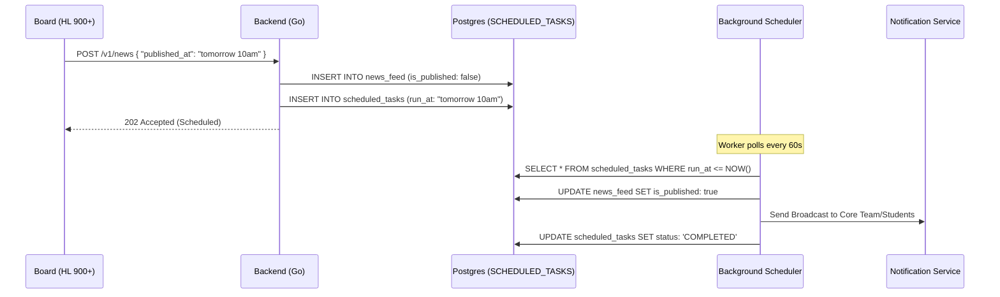
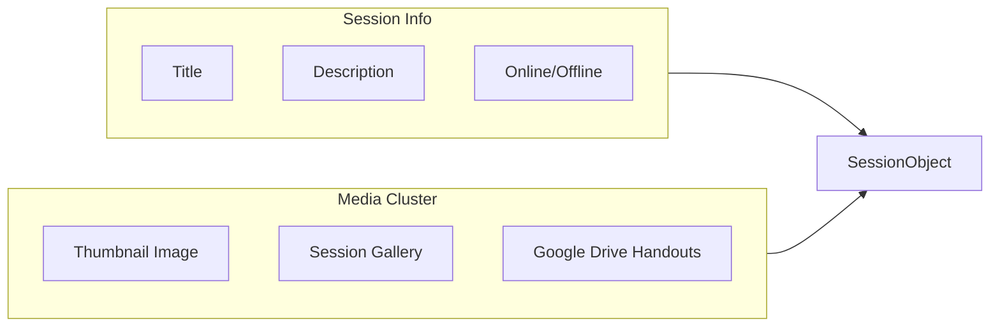

# Community Hub Features & Complex Logic

The GDGoC Benha System is more than a registration tool; it's a platform for community growth and professional management.

## 1. Automated Scheduling Engine

Managing announcements for a community requires precision. Our system uses a **Deferred Publishing Engine**.

## 2. Core Team Performance & Track Leadership

To maintain excellence, we track the performance of every core team member across all departments (Tech, HR, PR, etc.).

### Track Hierarchy Logic
Each track (e.g., Backend, Flutter, Android) has a dedicated leadership stack:
- **Head of Department (HL 800)**: Oversees all technical tracks.
- **Vice Head (HL 750)**: Second-in-command for large departments.
- **Track Lead (HL 600)**: Direct owner of a specific track's curriculum and team.
- **Core Team Members (HL 500)**: Active organizers and assistants who attend internal sessions.

### Scoring Metrics
| Activity | Points | Rule |
| :--- | :---: | :--- |
| **Session Attendance** | +10 | Logged via `SESSION_RECORDS` |
| **Task Completion** | +50 | Verified by Lead |
| **Leadership Evaluation**| +100 | Quarterly review by Head |
| **Session Absence** | -20 | Unexcused absence from internal meetings |

## 3. Rich Community Sessions

Sessions include high-quality media and academic resources to provide maximum value to Google Students.

- **Offline Sessions**: Location includes a physical address (e.g., "Main Hall, Engineering Faculty").
- **Online Sessions**: Location is a dynamic link (Google Meet).
- **Drive Integration**: All PDFs are linked directly from the official GDG Google Drive for centralized document management.

## 4. Community News Feed (The Pulse)

The news feed is the central nervous system of the GDG.
- **Targeting**: Posts can be restricted to specific tracks (e.g., "Backend-only announcement") or roles (e.g., "Internal message for Leads").
- **Real-time Delivery**: When a post goes live (immediately or via scheduler), an event is triggered to notify users via Webhook or Firebase Cloud Messaging (FCM).
