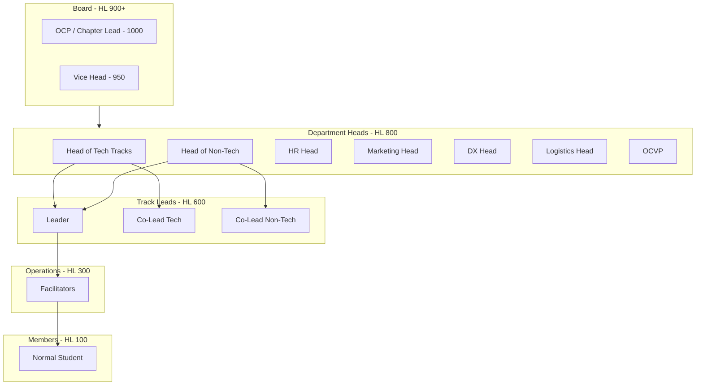

# Organizational Hierarchy & Granular RBAC

The GDGoC Benha System features a multi-departmental structure with distinct authority levels. This document outlines the hierarchy and the strictly enforced **Hierarchy Level (HL)** permission matrix.

## 1. The Core Organization Structure

Authority flows from the Board to the Heads of Departments, down to the Track Leads and Facilitators.



## 2. Granular Permission Matrix

Permissions are checked at the **API Middleware Layer** by comparing the user's `role.level` against the `required_level`.

| Feature | Action | Minimum HL | Responsibility |
| :--- | :--- | :---: | :--- |
| **Identity** | System-wide Audit Log View | 950 | Vice Head / OCP |
| | Manual Role Change | 1000 | OCP only |
| | Reset Any User Password | 800 | Relevant Heads |
| **Bootcamps** | Create/Delete Bootcamp | 950 | Board Only |
| | Create/Edit Track | 800 | Head of Tech/Non-Tech |
| | Assign Lead/Co-Lead | 800 | Head of Tech/Non-Tech |
| **Attendance**| Bulk Attendance Record | 300 | Facilitator |
| | Override Attendance Status| 800 | HR Head (Auditing) |
| | Export Attendance Sheet | 600 | Lead and Above |
| **Grading** | Input Score / Feedback | 300 | Facilitator |
| | Approve Track Graduation | 600 | Lead |
| | Override Final Grade | 800 | Head of Tech |
| **Forms** | Global Form Creation | 800 | Marketing Head |
| | Track Specific Form | 600 | Lead |
| | Review/Accept Submission | 800 | Relevant Heads |
| **News** | Global Announcement | 950 | Board |
| | Track Internal Post | 600 | Lead |
| **HR** | View Core Team Attendance | 800 | HR Head |
| | Performance Scoring | 800 | HR Head |

## 3. Implementation Policy: The Middleware Gatekeeper

In Go, we implement a higher-order function to wrap handlers:

```go
func (a *App) Authorize(minLevel int) Middleware {
    return func(c Context) error {
        userLevel := c.Get("user_level").(int)
        if userLevel < minLevel {
            return domain.ErrForbidden
        }
        return c.Next()
    }
}

// Usage in Router
r.POST("/v1/bootcamps", a.Authorize(950), a.CreateBootcamp)
```

## 4. Role-Based Cache (Redis)
To ensure high performance, a user's `RoleLevel` is cached in Redis upon login (Key: `user:{id}:hl`). This avoids a PostgreSQL join on every authenticated request.
- **Cache Invalidation**: Must occur immediately if a user's role is updated in the `USERS` table.
