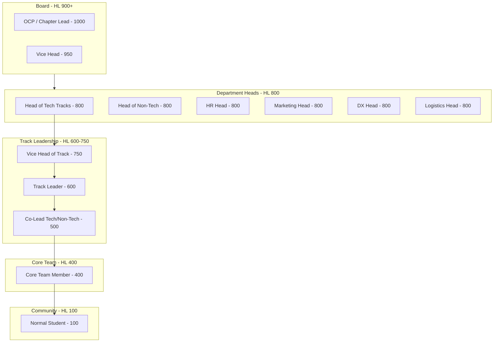

# Community Hub Hierarchy & Detailed RBAC

The GDGoC Benha System features a multi-departmental structure with distinct authority levels. This document outlines the hierarchy for both **Community Members** and the **Core Team**.

## 1. The Community Structure

Authority flows from the Board to the Heads of Departments, down to the Track Leads and Core Team Members.

## 2. Advanced Permission Matrix (The Community Hub)

Permissions are checked at the **API Middleware Layer** by comparing the user's `role.level` against the `required_level`.

| Feature | Action | Minimum HL | Responsibility |
| :--- | :--- | :---: | :--- |
| **Identity** | System-wide Audit Log View | 950 | Vice Head / OCP |
| | Manual Role Change | 1000 | OCP only |
| **Bootcamps** | Create/Delete Bootcamp | 950 | Board Only |
| | Create/Edit Track | 800 | Head of Tech/Non-Tech |
| **Sessions** | Create Session (Rich Media) | 600 | Track Lead |
| | Add Media to Gallery | 500 | Co-Lead |
| | Set Drive PDF Link | 600 | Track Lead |
| **Attendance**| Bulk Attendance Record | 300 | Facilitator |
| | View Core Team Stats | 800 | HR Head |
| | Evaluate Core Team | 800 | Dept Head or Above |
| **Scheduling** | Schedule News Publish | 800 | Marketing/Board |
| | Schedule Event Start | 600 | Track Lead |
| **Forms** | Create Global Form | 800 | Marketing Head |
| | Export All Submissions | 900 | Vice Head / Board |
| **News** | Global Announcement | 950 | Board |
| | Track Internal Post | 600 | Lead |

## 3. Core Team vs. Students: Operational Rules

The system distinguishes between **Internal** (Core Team) and **External** (Student) data.

- **Internal Sessions**: Marked with an `is_internal` flag. Only Core Team Members (HL 400+) can see these sessions. Attendance at these sessions contributes to `CORE_TEAM_STATS`.
- **Performance Evaluation**:
  - **Heads** can evaluate **Leads** and **Core Team Members** in their department.
  - **Board** can evaluate **Heads**.
  - Evaluations are strictly private and used for internal GDGoC growth tracking.

## 4. Track Hierarchy (Department Example)

### Tech Tracks (Managed by Head of Tech)
1. **Backend Development**: Head of Backend (800) -> Lead (600) -> Co-Lead (500) -> Core Team Members (400).
2. **Flutter Development**: Head of Flutter (800) -> Lead (600) -> Core Team Members (400).
3. **Cyber Security**: Head of Security (800) -> Lead (600) -> Core Team Members (400).

*Note: Large tracks can have a Vice Head of Track (HL 750) if requested by the Board.*
