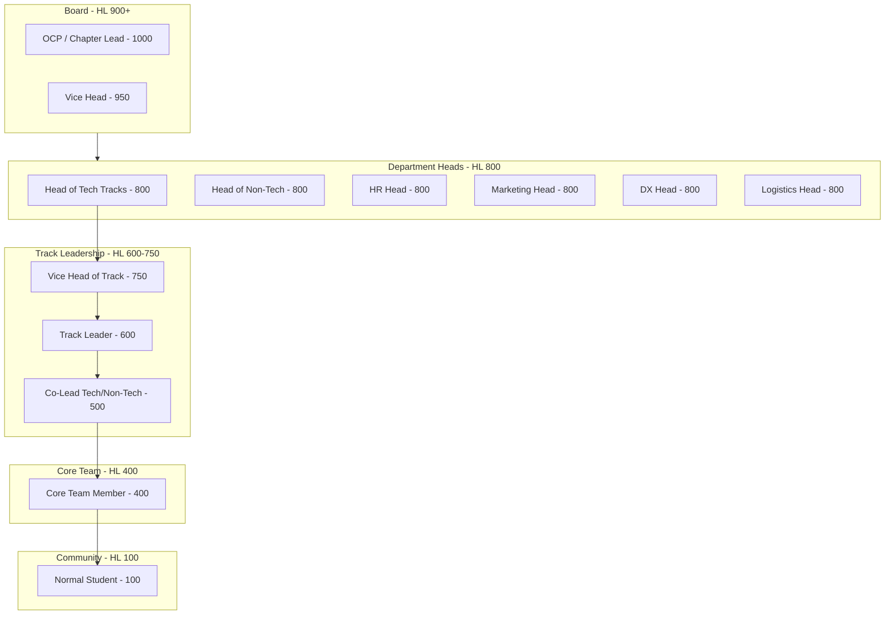

# Community Hub Hierarchy & Detailed RBAC

The GDGoC Benha System features a multi-departmental structure with distinct authority levels. This document outlines the hierarchy for both **Community Members** and the **Core Team**.

## 1. The Community Structure

Authority flows from the Board to the Heads of Departments, down to the Track Leads and Core Team Members.



## 2. Track-Specific Leadership Roles (Examples)

The system is highly granular. Each technical department (e.g., Backend, Flutter) has its own leadership stack:

| Department | Head (HL 800) | Vice Head (HL 750) | Leader (HL 600) | Co-Leads (HL 500) |
| :--- | :--- | :--- | :--- | :--- |
| **Backend** | Head of Tech | Vice Head (Backend) | Backend Lead | Go Co-Lead |
| **Flutter** | Head of Tech | Vice Head (Flutter) | Flutter Lead | Dart Co-Lead |
| **CyberSec** | Head of Tech | - | Security Lead | Network Co-Lead |

## 3. Granular Permission Matrix (Staff Engineer Level)

Permissions are strictly enforced at the **Middleware Layer** using the user's Hierarchy Level (HL).

| Feature | Action | Minimum HL | Edge Case Handling |
| :--- | :--- | :---: | :--- |
| **Identity** | Manual Role Change | 1000 | Only OCP can change a Head to Board. |
| | System Audit Log View | 950 | Restricted to prevent data leaks. |
| **Bootcamps**| Change Bootcamp Status | 800 | To move from SCREENING to ACTIVE. |
| | Delete Track Enrollment | 800 | Requires HR Head approval (log-only). |
| **Sessions** | Publish Attendance Code | 300 | Valid for 10-min window in Redis. |
| | Generate Session QR | 600 | Signed JWT with short TTL. |
| | Edit Past Attendance | 800 | Audit log records the "Reason for Edit". |
| **Events** | Void Public Ticket | 900 | For security violations at venue. |
| | Capacity Override | 1000 | OCP can bypass `max_seats` constraint. |
| **Grading** | Final Grade Override | 800 | Head of Tech only (Audited). |
| | Issue Certification | 600 | Automates PDF generation via worker. |
| **Scheduling** | News Feed Purge | 1000 | Hard-delete of news (Rare). |

## 4. Operational Rules for Core Team

- **Session Access**: Core Team Members (HL 400+) can attend both Student and Internal sessions.
- **Performance Evaluation**:
  - **Heads** can evaluate **Leads** and **Members**.
  - **Board** evaluates **Heads**.
  - Points contribute to the `CORE_TEAM_STATS` table for end-of-season awards.

## 5. Middleware Logic Example (Go)

The `Authorize` middleware is the first line of defense. It fetches the HL from **Redis** (Key: `user:{id}:hl`) and compares it with the required level for the specific route.

```go
func (a *App) Authorize(minLevel int) Middleware {
    return func(c Context) error {
        userLevel := c.Get("user_level").(int)
        if userLevel < minLevel {
            // Log attempt to AUDIT_LOGS as unauthorized access
            return domain.ErrForbidden
        }
        return c.Next()
    }
}
```
